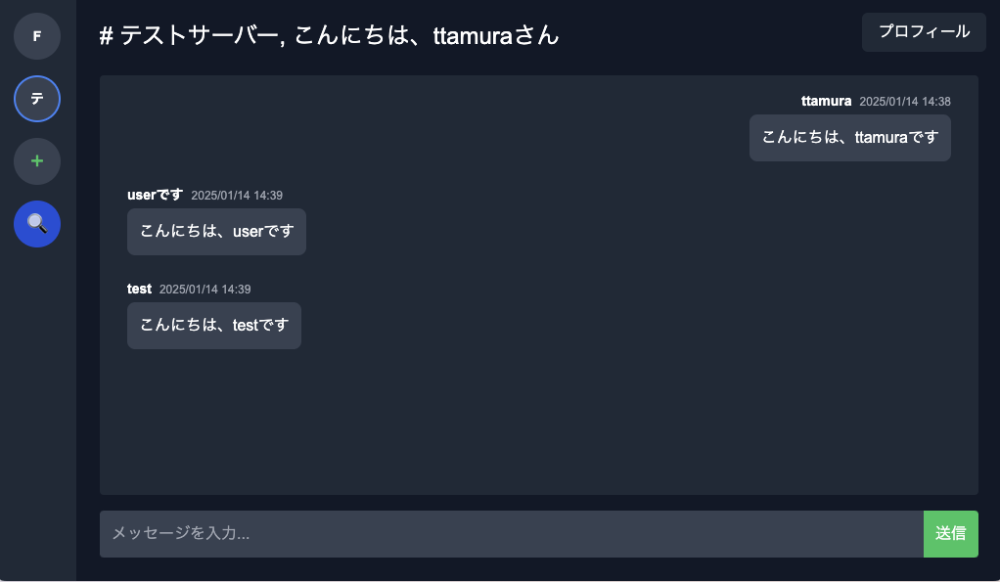

# **DiscordLike-app**

リアルタイムのチャット機能を提供するWebアプリケーション

[**ここからアプリへアクセスできます**](http://13.114.232.178:8000/login)

### **テスト用ユーザー**

- **メールアドレス**: `test@test`
- **パスワード**: `test`

---

## **ER図**

以下のER図は、アプリのデータベース設計を表しています：

User ──< ServerMember >── Server ──< Channel ──< Message

---

## **使用技術**

| **カテゴリ**    | **技術スタック**             |
|-------------|------------------------|
| **バックエンド**  | Ruby on Rails          |
| **フロントエンド** | TypeScript / Next.js   |
| **データベース**  | MySQL / Redis          |
| **インフラ**    | AWS Lightsail / Docker |

